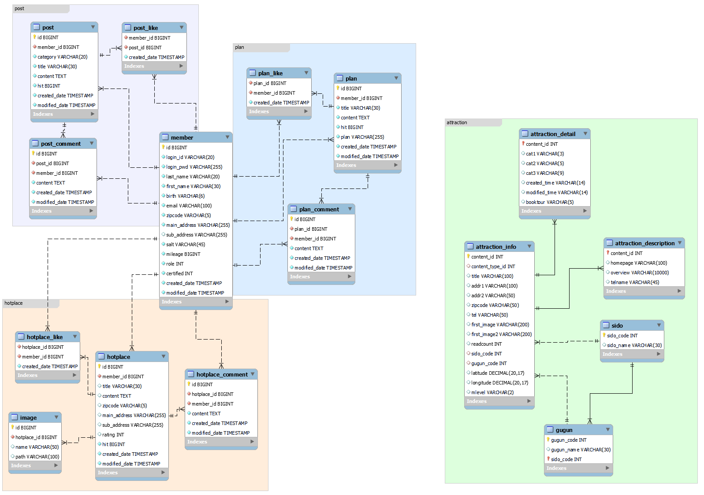

# ⛺ FAR AWAY 🚢

## ✅ Project Overview
 사용자 기반 추천을 통해 한국의 다양한 관광지, 먹거리, 축제, 행사 등을 검색할 수 있는 추천 기반 지역 관광 소개 페이지 
- '지역별 여행지' 에서 원하는 지역과 관광지 유형을 선택하면, 해당 지역의 관광정보를 제공해요.
- '나의 여행계획'를 통해 나만의 여행 꿀팁을 공유할 수 있어요.
- '핫플 자랑하기'를 통해 내가 발견한 🔥핫플레이스를 자랑해보아요!
- '여행정보 공유'를 통해 회원끼리 유용한 정보를 나눌 수 있어요.

## ✅ Team INFO 
멋쟁이 팀원들을 소개할게요. 😊
### 🐷 최영환 
- GitHub: [longBright](https://github.com/longBright)
### 🐯 장유진
- GitHub: [yoojinjangjang](https://github.com/yoojinjangjang)
### 🙈 전인혁
- GitHub: [wjs5025](https://github.com/wjs5025)
### 🐼 홍진식
- GitHub: [jinsikhong](https://github.com/jinsikhong)

## ✅ ERD

## ✅ 기본 기능
### ✔ 메인 화면 
 - Far Away 사이트의 추구하는 목적과 세부 설명을 담고 있으며, 빠르게 지역정보를 검색할 수 있는 버튼인 `Search Place` 를 제공함으로써 사용자의 UX를 고려한 메인페이지 입니다. 

### ✔ 로그인 화면
- ID와 PASSWORD 를 입력한 후 로그인 기능을 제공하는 페이지입니다. 
- 로그인 시 아이디 저장을 통해 자신의 아이디를 저장할 수 있습니다. 

### ✔ 회원가입 화면
- 회원정보를 입력한 후 회원가입을 진행할 수 있는 페이지입니다. 
- 회원의 아이디가 이미 등록되어 있는 중복 검사가 가능합니다. 
- 회원이 작성한 비밀번호와 비밀번호 확인에 입력한 두 비밀번호의 일치 여부 확인이 가능합니다. 
- 회원이 작성한 각종 회원의 정보 유효성 검사가 가능합니다. 
  - 이메일 형식 (aaa@aaa.com)
  - 우편번호 형식 (5글자)

### ✔ 마이페이지 화면
- 로그인한 회원의 정보를 확인할 수 있습니다.

- 자신의 회원 정보 수정이 가능합니다.
  - 회원 정보 수정을 위해서는 비밀번호 입력이 필요합니다.
  

### ✔ 아이디&비밀번호 찾기 화면
- 회원이 자신의 아이디와 비밀번호를 찾아볼 수 있습니다. 

## ✅ 관광지 검색 기능
### ✔ 관광지 검색 화면
- 원하는 지역의 관광지 정보의 검색이 가능합니다. 
- 시도, 구군, 컨텐츠 타입을 선택한 후 검색버튼을 클릭할 경우 해당 관광지 정보를 확인할 있습니다. 
- 마커를 클릭하여 특정 지역의 관광지 세부 정보를 확인할 수 있습니다. 

## ✅ 여행 경로 공유 기능
### ✔ 여행 경로 등록 화면
- 회원이 여행경로에 포함시킬 여행지 정보를 검색할 수 있습니다. 
- 검색한 여행지 정보 중 여행경로에 포함시킬 여행지 마커를 클릭하여 경로를 정할 수 있습니다. 
- 여행 경로의 제목과 내용을 입력할 수 있습니다. 
- 마커위에 마우스를 올릴 경우 관광지 세부 정보를 확인할 수 있습니다. 

### ✔ 여행 경로 전체 조회 화면
- 모든 회원이 저장한 여행 경로를 게시판 형식으로 조회할 수 있습니다. 
- 제목과 작성자이름으로 여행 경로를 검색할 수 있습니다. 
- 페이징 처리를 통해 여행 경로를 조회할 수 있습니다. 
- 전체 여행 경로들 중 세부 조회를 할 여행 경로를 클릭하여 여행 경로 상세 조회 화면으로 이동할 수 있습니다.

### ✔ 여행 경로 상세 조회 화면
-  등록된 여행 경로를 지도에서 확인이 가능합니다. 
  - 회원이 등록한 여행 경로 순서대로 `My Plan` 지도에서 확인이 가능합니다.
  - 회원 등록 여행지 기반으로 최단 경로를 `Shortest Plan` 지도에서 확인이 가능합니다. 
  - 여행 경로의 제목과 내용의 조회가 가능합니다. 
  - 자신이 등록한 여행 경로인 경우 수정이 가능합니다. 

### ✔ 여행 경로 수정 화면
- 회원이 등록한 여행 경로의 수정이 가능합니다. 
- 수정 시 들어갈 여행 경로의 검색이 가능합니다. (여행 경로 등록과 동일합니다.)
- 여행 경로의 제목과 내용의 수정이 가능합니다.

## ✅ 게시글 기능 
### ✔ 게시글 등록 화면
- 회원이 게시글을 등록할 수 있습니다. 
- 게시글의 제목과 내용을 입력하여 등록할 수 있습니다. 

### ✔ 게시글 전체 조회 화면
- 모든 회원이 등록한 게시글을 조회할 수 있습니다. 
- 제목과 작성자로 검색이 가능합니다. 
- 페이징 처리를 통해 게시글을 조회할 수 있습니다. 
- 전체 게시글 중 세부 조회를 할 게시글을 클릭하여 게시글 상세 조회 화면으로 이동할 수 있습니다.

### ✔ 게시글 상세 조회 화면
- 등록된 게시글의 제목과 내용을 확인할 수 있습니다. 
- 자신이 등록한 게시글일 경우 수정이 가능합니다. 

### ✔ 게시글 수정 화면
- 회원이 등록한 게시글의 수정이 가능합니다. 
- 게시글의 제목과 내용의 수정이 가능합니다. 

## ✅ 핫플레이스 기능
### ✔ 핫플레이스 등록 화면
- 회원이 생각하는 핫플레이스를 등록할 수 있습니다. 
- 제목, 내용, 우편번호, 주소, 별점 등록이 가능합니다. 
- 파일 업로드 구현 중에 있습니다. 

### ✔ 핫플레이스 전체 조회 화면
- 모든 회원이 등록한 핫플레이스를 게시글 형태로 확인할 수 있습니다. 
- 제목과 작성자로 핫플레이스를 검색할 수 있습니다. 
- 페이징 처리를 통해 핫플레이스를 조회할 수 있습니다. 

### ✔ 핫플레이스 상세 조회 화면
- 등록된 핫플레이스의 세부 정보를 조회할 수 있습니다. 
- 자신이 등록한 핫플레이스일 경우 수정 및 삭제가 가능합니다. 

### ✔ 핫플레이스 수정 화면
- 회원이 등록한 핫플레이스의 수정이 가능합니다. 
- 핫플레이스의 제목, 내용, 우편번호, 주소, 평점 등의 정보 수정이 가능합니다. 
- 파일 다운로드 구현 중에 있습니다. 

